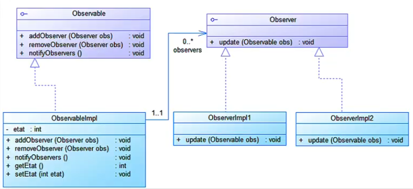
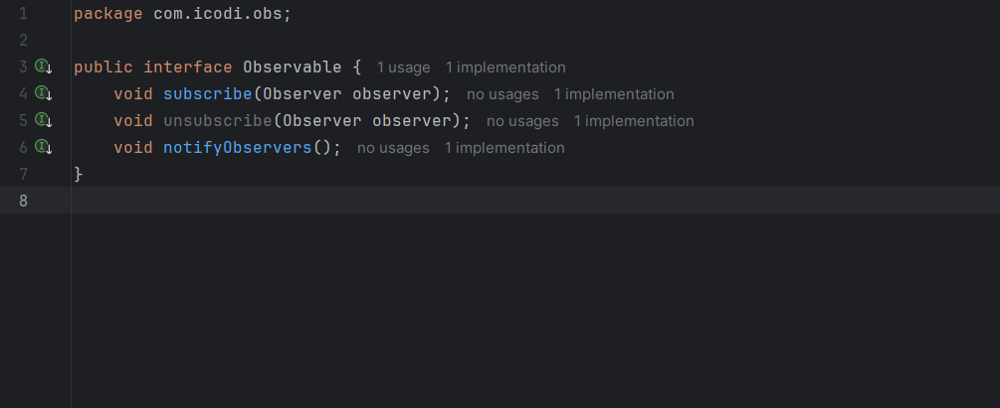
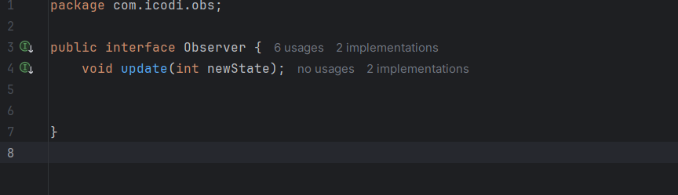
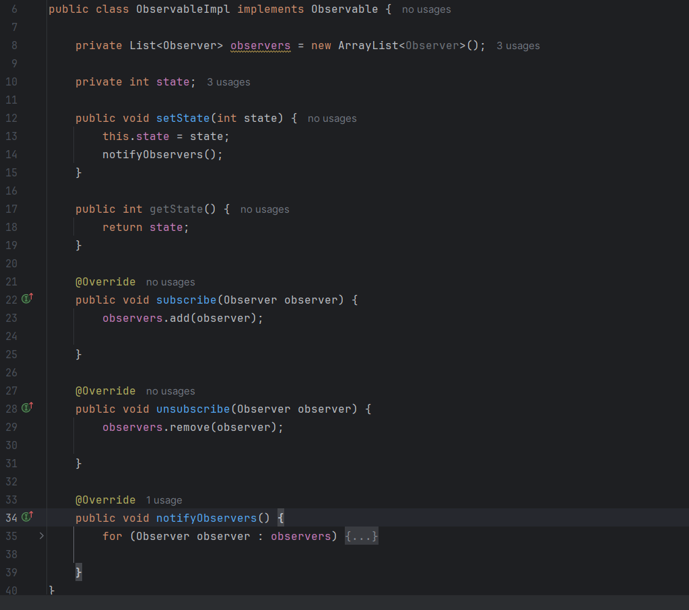
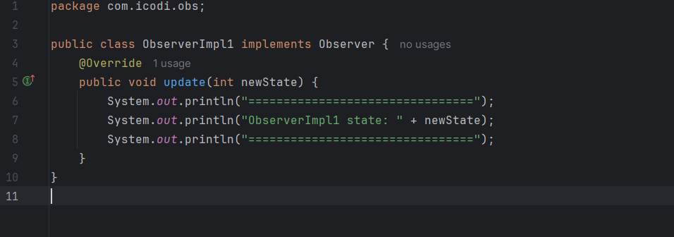
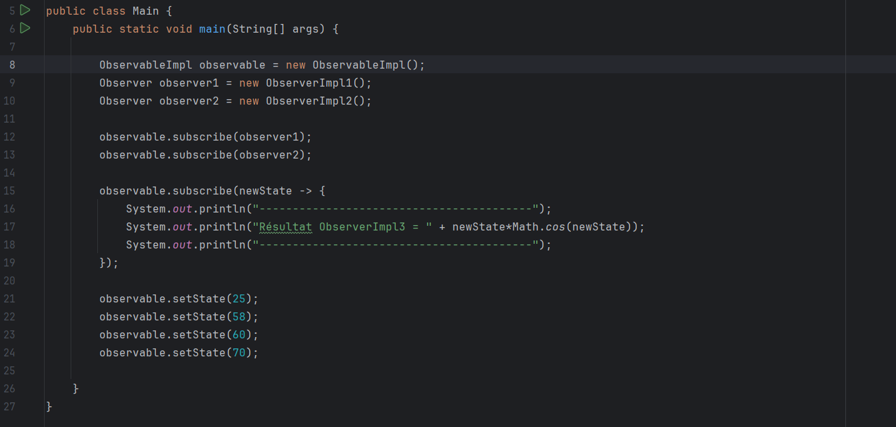
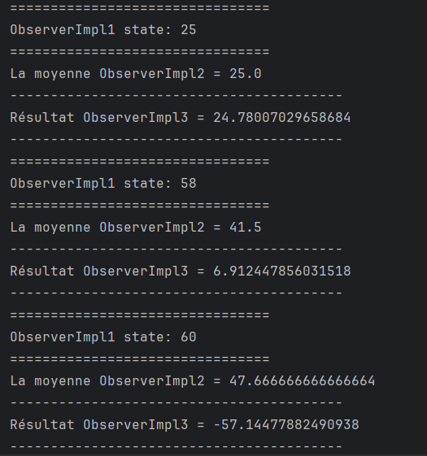

<h2>Design Pattern Observer</h2>
<h3>Présentation du Pattern Observer</h3>
Le <strong>pattern Observer</strong> (ou Observateur) est un pattern de conception comportemental qui définit une relation de dépendance un-à-plusieurs entre objets. Lorsqu'un objet change d'état, tous ses dépendants en sont automatiquement notifiés et mis à jour.
<h3>Concept</h3>
Imaginez un système d'abonnement : 
<ul>
<li>Sujet (Subject) : L'objet qui détient l'état et notifie les observateurs</li>
<li>Observateurs (Observers) : Les objets qui souhaitent être informés des changements</li>
</ul>

<h3>Structure</h3>

<h3>Implémentation</h3>
<ul>
<li>Interface Observable (le Sujet)</li> 

<li>Interface Observer (Observateur)</li> 

<li>Implémentation de l'Observable (le Sujet concret)</li> 

<li>Implémentation de l'Observer (Observateur concret)</li> 

</ul>

<h3>Classe d'utilisation</h3>

<h3>Résultat</h3>

<h3>Avantages</h3>
<ul>
<li><strong>Couplage faible</strong> : Les sujets et observateurs sont indépendants</li>
<li>Extensibilité</strong> : Ajout facile de nouveaux observateurs</li>
<li>Communication broadcast </strong> : Notification automatique à tous les abonnés</li>
<li>Principe OCP</strong> : Ouvert à l'extension, fermé à la modification</li>
</ul>

<h3>Inconvénients</h3>
<ul>
<li><strong>Notifications non contrôlées</strong> : Les observateurs peuvent être notifiés inutilement</li>
<li>Risques de memory leaks</strong> si les observateurs ne sont pas correctement détachés</li>
<li>Ordre des notifications</strong> non garanti</li>
</ul>

<h3>Cas d'Utilisation Courants</h3>
<ul>
<li>Systèmes d'événements (clics souris, touches clavier)</li>
<li>Pattern MVC (Model notifie les Views)</li>
<li>Systèmes de messagerie</li>
<li>Tableaux de bord en temps réel</li>
<li>Systèmes de logs et monitoring</li>
</ul>

Le pattern Observer est essentiel pour créer des applications réactives et découplées, permettant une communication efficace entre composants sans dépendances directes.